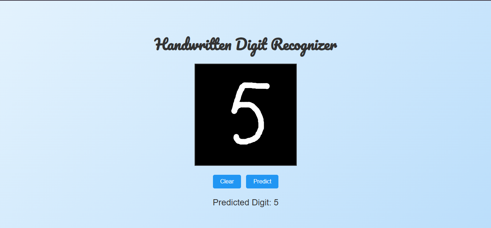

# Handwritten Digit Recognizer

This project is a web-based application that allows users to draw handwritten digits on a canvas, submit them for prediction, and display the predicted digit. It uses a pre-trained Convolutional Neural Network (CNN) model to recognize the digit.

---

## Features

- **Interactive Drawing Canvas**: A responsive canvas with inverted colors (black background and white drawing lines).
- **Stylish Interface**: A modern design with a gradient background and stylish fonts.
- **Digit Prediction**: Uses a pre-trained CNN model to recognize handwritten digits.
- **Responsive Design**: Works on different devices, including desktops, tablets, and mobile phones.

---

## Technology Stack

- **Frontend**: HTML, CSS, JavaScript
- **Backend**: Flask (Python)
- **Machine Learning Model**: TensorFlow/Keras CNN model

---

## Installation

1. **Clone the Repository**:
   ```bash
   git clone https://github.com/your-repo/handwritten-digit-recognizer.git
   cd handwritten-digit-recognizer
   ```

2. **Set Up Python Environment**:
   ```bash
   python3 -m venv venv
   source venv/bin/activate  # On Windows, use `venv\Scripts\activate`
   ```

3. **Install Dependencies**:
   ```bash
   pip install -r requirements.txt
   ```

4. **Add the Pre-trained Model**:
   - Place your `.keras` file in the project directory.
   - Update the path in the Flask app (`app.py`) if necessary.

5. **Run the Flask App**:
   ```bash
   python app.py
   ```

6. **Open in Browser**:
   - Navigate to `http://127.0.0.1:5000`.

---

## Project Structure

```
project/
├── app.py                # Flask application
├── templates/
│   └── index.html        # Frontend HTML file
├── model.keras           # Pre-trained Keras model (replace with your model)
├── requirements.txt      # Python dependencies
└── README.md             # Project documentation
```

---

## Usage

1. Draw a digit on the canvas using your mouse or touch.
2. Click the **Predict** button to submit the digit.
3. View the predicted digit displayed below the canvas.
4. Use the **Clear** button to reset the canvas and start again.

---

## Requirements

- Python 3.7+
- Flask
- TensorFlow/Keras
- PIL (Pillow)

---

## Screenshots

### Main Interface



---

## Contributing

Contributions are welcome! Feel free to submit a pull request or open an issue.

---

## License

This project is licensed under the [MIT License](LICENSE).

---

## Acknowledgements

- **Google Fonts** for the stylish heading font.
- **TensorFlow/Keras** for the machine learning model.
- **Flask** for the backend framework.

---

Enjoy using the Handwritten Digit Recognizer!
